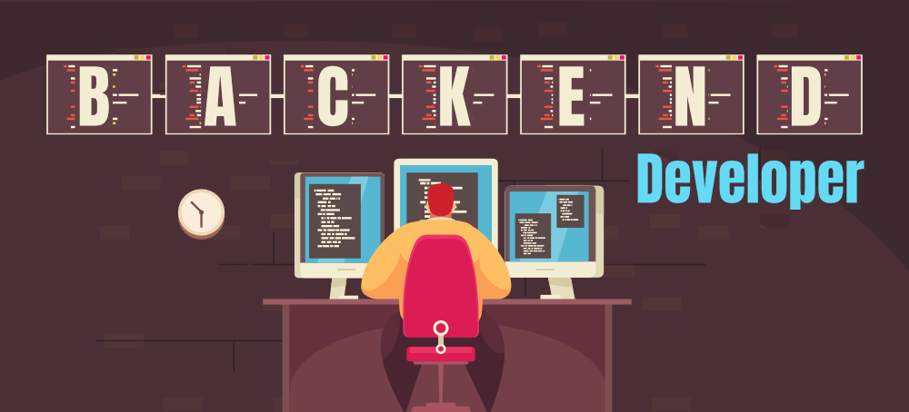

### Junior Software Engineer 👋 Fatih Kayacı 

# Ben Junior Software Engineer
 Junior Software Engineer olarak, ASP.NET ve Web API üzerine yoğunlaşarak backend geliştirme alanında projeler üretiyorum. Bilgisayar Mühendisliği bölümünden yeni mezun oldum ve C#, .NET gibi modern programlama dilleri ile sunucu tarafı geliştirme, API entegrasyonu ve veritabanı yönetimi üzerine çalışıyorum. Ayrıca, Unity ile oyun geliştirme ve PHP, Java, JavaScript gibi modern dillerle web geliştirme projelerinde de deneyim kazandım. Teknoloji dünyasında kendimi sürekli geliştirerek, çözüm odaklı projelerde yer almak benim için büyük bir tutku.
  
 
  
## Hakkımda

- 🎓 Eğitim: Bilgisayar Mühendisliği Lisans
- 💼 Çalışma Durumu: Şu anda herhangi bir yerde çalışmıyorum, ancak kendimi geliştirmek için çeşitli eğitim platformlarında eğitimler alıyorum.
- 🌱 Şu anda öğreniyorum: C# yazılım bilgimi geliştiriyorum, ASP.NET Web API üzerine eğitimler alıyorum. Ayrıca, çeşitli teknolojiler ve temel bilgilerimi güçlendirmek için eğitimlere devam ediyorum.
- 🛠️ Uzmanlık Alanlarım: ASP.NET, Web API, C#, Veritabanı Yönetimi
- ⚡ İlgi Alanlarım: Backend geliştirme, API entegrasyonu, oyun geliştirme (Unity), web geliştirme (PHP, Java, JavaScript)

## Projelerim

### Katsis
  
  
- **Açıklama:** Bu projede, bina yönetim sistemi geliştirmeyi hedefliyoruz. Proje, binada yaşayan kiracıların ve kat maliklerimizin, binayı yöneten yöneticilerin işlerini kolaylaştırmak amacıyla tasarlanmıştır. Kullanıcılar, binadaki tadilat ve tamirat işlemleri için gereken aidatların yanı sıra ödenmesi gereken faturaları sistem üzerinden kolayca ödeyebilecekler. Bu sayede, hem oturanların hem de yöneticilerin iş süreçleri büyük ölçüde hızlanacak ve kolaylaşacaktır.
- **Teknolojiler:** HTML, CSS, JavaScript, PHP, MySQL gibi modern web teknolojilerini kullanarak geliştirmekteyiz.
- **GitHub Repo:** https://github.com/fatihkayaci/Katsis

  
## İletişim

- 📫 Bana ulaşın: fatihkayaci@yahoo.com
- 🌐 LinkedIn: https://www.linkedin.com/in/fatih-kayacı-79180a28a/

 
